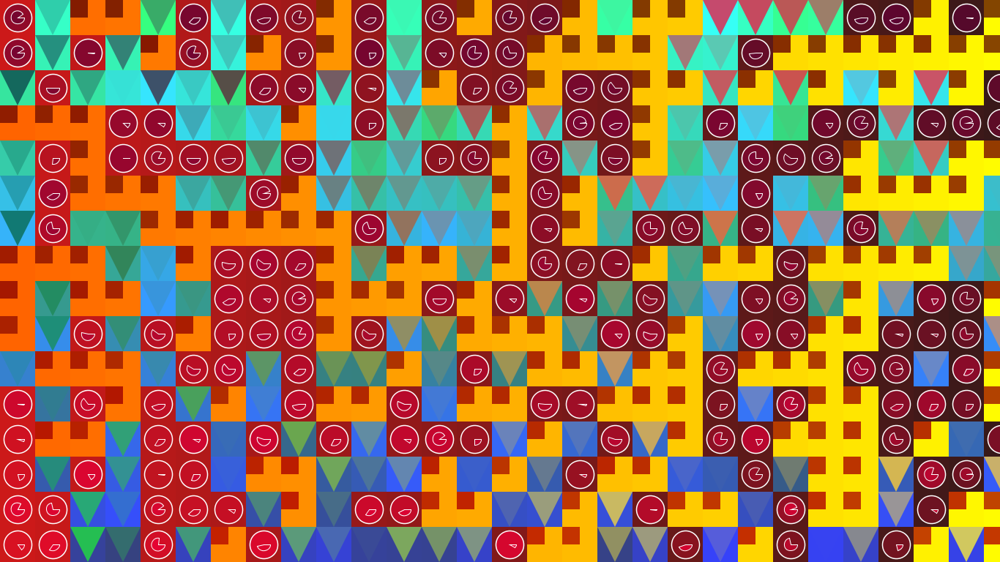

## Procedural Quilt



### Due Date
12:30 p.m. Thursday, September 29th, 2016

### Philosophy

The first step in revising code in Processing is to replace constants with variables. For example,

``` java
ellipse(320, 160, 50, 60);
```
    
becomes

``` java
float x = 320; float y = 160; float w = 50; float h = 60;
ellipse(x, y, w, h);
```
    
This step, equivalent to the step out of arithmetic and into algebra, is important for more than movement via addition or subtraction of x/y in the draw call. It is the first step to code becoming durable, widely applicable to multiple situations. It is also the first step to code becoming modular, able to be recombined with other code to produce a variety of aesthetic experiences.

The goal of this project is to create a digital quilt out of several patches. You will create the patches, and the quilt will pull these patterns pseudo-randomly out from the basket and incorporate them. From the artistic perspective, this cultivates the following ideas:

* Working under constraint as a method for artistic growth.
    
* __Repetition with a difference__: Stylistic consistency shows sustained intention (choices about organic vs. inorganic shapes, relative scale, color, etc. are unified by a goal or idea). Programmatic or procedural thinking can aide in __amplifying__ this intention by repeating simple procedures or shapes until they become complex patterns. Simultaneously, the use of variables allow compositional elements to vary.
    
* The value of tiling (horizontal, vertical, both) in visual design.
    
From the project management perspective, the imposed constraint prevents overscoping.

From the software engineering perspective, this demonstrates that the syntax of Processing/Java is guided by the principle of [Extensibility](https://en.wikipedia.org/wiki/Extensibility).

### Directions

* Download or copy the .pde files from the course GitHub page.
* In the main sketch:
    * Declare an object of the data type Quilt.
    * In setup:
        * Initialize the Quilt object with a constructor. The constructor takes one argument: the number of patches that will appear on the short edge of the screen.
        * Add patterns you have created to the quilt object using the addPattern instance method.
    * In draw:
        * Call the quilt object's draw function.
* In separate tabs:
    * Name the tab appropriately. It is recommended that you match the name of the tab to the name of the class.
    * Define a class that extends the Patch class.
    * Define the draw method.
    * Use the variables x, y, w and h as the foundational references for the shapes which constitute the patch.
    
``` java
class HoundsToothPatch extends Patch {
    void draw(float x, float y, float w, float h) {
        // Your code here.
    }
}
```

### Inspiration

* [Libs Elliott](http://www.libselliott.com/)
* [Joshua Davis - _Aim High, Keep Moving_ ]
* Crossman Gallery: FABRICation
    * September 8 to October 8
    * September 28, 4 p.m. - [Kristy Deetz](http://www.uwgb.edu/deetzk/) gallery talk
* [zeitguised](http://www.zeitguised.com/geistxyz/#geistxyz01)
* [A Pattern A Day (Tumblr)](http://a-pattern-a-day.tumblr.com/)

### Evaluation

Points | Description
------ | -----------
5 | Runs without throwing Exceptions.
5 | Main sketch file shares same name as containing folder. Media files used by sketch are included in /data subfolder. Folder is zipped. Follows naming convention f16_magd271_lab3_Yourlastname.zip .
30 | Sketch adds a minimum of three patches (classes which extend the class Patch) to the quilt.
10 | Sketch shows sustained artistic intent: variation is balanced with consistency; color choices are considered in relation to each other and to the whole; type of and relative scale of shapes are considered in relation to each other and to the whole.
50 | TOTAL