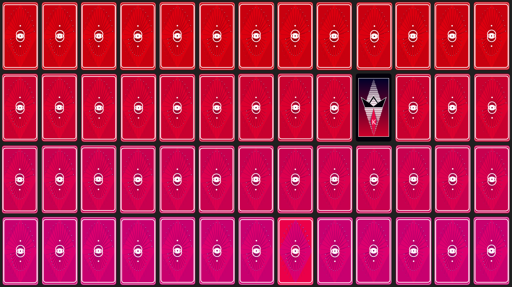

## Deck of Cards



### Due Date
12:30 p.m. Thursday, October 13th, 2016

### Philosophy

The previous assignment, the procedural quilt, introduced you to the concept of __scalability__ - through the use of variables rather than constant numbers - and __modularity__ - the extension of a class created by someone else to your own class. Whereas that assignment allowed you to work with elementary forms which were then laid into a grid, this assignment requires a more dedicated attention to the diversity of shapes permitted by Processing (triangles, quads, arcs, curves, contours and custom shapes). This is because a playing card is both an anonymous tile in a collection (when observed face down), and a unique card with an identity and a value (when observed face up). In order to create this aesthetic effect, you will have to dig more directly into the code provided, locating the relevant function call and definition, and carving out the placeholder visuals so as to replace it with your own.

* From the artistic perspective, this assignment encourages:

    * Balancing the semiotic needs of a game with aesthetics. This means that, for example, a 10 of Diamonds must communicate to the player that it is a 10 of Diamonds for the card to actually be usable in play.

    * Use of advanced shape and color.

    * Balancing geometric or abstract shape with more impressionistic, representational shape (i.e., face cards may represent a stylized human figure).

* From the project management perspective this assignment enforces:

    * The importance of balancing general with specific goals.

    * Making a choice and following through with that choice. This is because it would be impractical to design the face of 52 cards, especially the Jack, King, Queen and Joker.

* From the scripting perspective this assignment demonstrates:

    * Enumerations
        * Simple
        * With constructors and values

    * Shuffling of a [collection](https://docs.oracle.com/javase/tutorial/collections/intro/), specifically a stack.

    * The implementation of an interface, specifically for the purposes of making a complex object easily comparable to another object of the same type, and thus able to be sorted in a collection.

    * User interactibility via 
        * events
        * mathematical comparisons so as to determine intersection with a bounded region

### Directions

* Download the .pde files from the course on GitHub.
    * __It is not a good idea to copy and paste__ due to the number of .pde files and the tendency to lose closing and opening curly braces.
    * Save your own copy of the assignment template by going to File > Save As...

* Decide whether you would like to work with just a single card or the whole deck.
    * Working with the whole deck means that the aspect ratio of each card will not be maintained, but may stretch for the 13 x 4 cards to fit on the screen.

* Based on your decision, comment in/out the appropriate lines in the main sketch:
    * The variable declaration at the top of the main sketch.
    * The variable assignment in setup.
    * The call to the variable's draw instance method in draw.
    * The call to the variable's mousePressed instance method in mousePressed.
    
* In the card class, scroll to the bottom to the functions drawFront and drawBack.
    * Replace the code in these functions with your own.
    * Design a pattern for the back of the card.
    * Design the front for __one card of your choice__.
        * The difficulty of the face card you choose to design will contribute toward your grade. For example, I would expect exceptional design if you chose the Two of Diamonds, whereas I would be more lenient if you chose the King of Spades.
        * If you choose to work with the deck rather than an individual card, you will have to figure the logic for how to make your face design appear only when the appropriate card is flipped over, rather than appearing on all flipped cards.
        * Feel free to remove the drawLabel function: it is there for diagnostic purposes as you work.
        
* __Optional:__ If you would like to add or change user interaction via mousePressed functionality, go for it.
    
``` java
private void drawBack() {
    if (bounds(mouseX, mouseY)) {
        // Your code here (on mouse hover).
    } else {
        // Your code here.
    }
}

private void drawFront() {
    if (bounds(mouseX, mouseY)) {
        // Your code here (on mouse hover).
    } else {
        // Your code here.
    }
}
```

### Inspiration

* [Paul Dersidan - Earth Fire Wind Water](https://www.behance.net/gallery/4783481/Earth-Fire-Wind-Water)
* [Ben Newman - Prime](https://www.artofplay.com/collections/playing-cards/products/prime)
* [Tatiana Lara - didot](https://www.behance.net/gallery/2088492/didot-playing-cards)
* [Rochelle Li - Spirograph](https://www.behance.net/gallery/2436997/Handmade-Spirograph-Playing-Cards-Design)
* [Chris Finn - Royalty: Typographic](https://www.behance.net/gallery/8862415/Royalty-Typographic-Playing-Cards)
* [Arantxa Rueda - Ordaga](https://www.behance.net/gallery/Ordaga/3767792)
* [Tungstene](https://www.behance.net/gallery/8214201/Tungstene-Playing-Cards)
* [Luke Bott - Robocycle](https://www.behance.net/gallery/9346429/Robocycle)
* [Oksal Yesilok - Whimsical](https://www.behance.net/gallery/36784187/Whimsical-Playing-Arts-First-Edition)
* [Cristiano Domingos - Typographic](https://www.behance.net/gallery/4264289/Playing-Cards-Typography)
* [Pocono Modern - The Retro Deck](https://www.artofplay.com/products/the-retro-deck)
* [Turnstyle - Alice in Wonderland](https://www.artofplay.com/collections/playing-cards/products/alice-in-wonderland)
* [DKNG - Red Wheel](https://www.artofplay.com/collections/playing-cards/products/red-wheel)
* [Sam Dallyn - Minimal Playing Cards](http://www.samdallyn.co.uk/Projects/Cards.aspx)

### Evaluation

Points | Description
------ | -----------
25 | Graph paper has been used to plan the design of the card front and back prior to implementation.
5 | Submission adheres to naming convention f16_magd271_lab4_Yourlastname.zip . Submission is the compressed sketch folder. The main sketch shares the same name as the sketch folder. Any media files used by the sketch are included in the /data subfolder.
5 | Sketch runs without throwing any Exceptions.
20 | The back of the card(s) has a student created design.
20 | The face of one card has a student created design. This design demonstrates understanding of more advanced shape functionality in Processing. The design balances legibility with style, meaning a player can read the value of the card but also appreciate it aesthetically.
75 | Total

Any media included with Processing sketches are presumed to be the work of the student unless otherwise stated. Media used from outside sources are expected to be altered substantially by the student. When media from outside sources are used, a notice of attribution at the top of the main sketch in a comment should be provided. This is not only for ethical and legal reasons, but so __you can incorporate the work you do here into your portfolio__ if you choose.