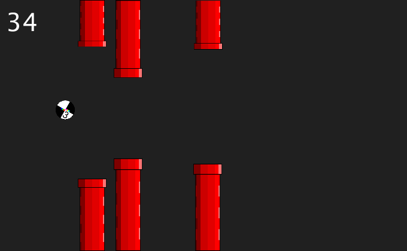

## Flappy Clone

### Due Date
12:30 p.m. Thursday, October 27th, 2016

### Philosophy

The previous two assignments reviewed static composition. This assignment emphasizes dynamic composition in an interactive environment. 

* From the artistic perspective, this assignment encourages:

    * Implementing the 12 Principles of Animation.
    
    * Developing a pipeline between external image editing software and Processing.

* From the project management perspective, this assignment encourages:

    * Assessing the appropriate scope of an idea in relation to the student's skillset.

* From the scripting perspecitve this assignment demonstrates:

    * A state machine to control game states using a Map and classes.
    
    * A state machine to act as animator.
    
    * A timer which starts upon entering a state and records the elapsed time.

### Directions

* Use graph paper to sketch your design.

* Download the files from the course GitHub page. Make your own copy of the assignment model. __The leftmost tab in your sketch is your main tab. The global functions `void setup() {}` and `void draw() {}` must be in this tab. This tab must have the same name as the folder which contains the whole sketch.__

* Create the necessary images for your design. In Processing's menu bar, go to Sketch > Add File... to import your images into your sketch folder.

* In the Background tab, place your code to draw the game's background in the Background class's draw function.

* In the FlappyBird tab, use `Animation a = new Animation("myAnimationName", 20, loadImage("myImageFile.png"));` to load the images for the flapping animation into the Processing sketch. The number 20 stands for the interval before the animation progresses to the next image in your sequence.

* In the Title tab, style the title screen by changing the code in the `onSustain() { /* ... */ }` function.

### Evaluation

Points | Description
------ | -----------
5 | Sketch runs without throwing Exceptions.
5 | The sketch's main tab matches the name of the sketch folder. The sketch is named according to the following convention: f16_magd271_lab5_yourLastName.zip.
5 | The sketch folder has been compressed into a zip file.
15 | Graph paper has been used to plan and design the visual aspects of the flappy clone.
15 | The title screen has been re-styled.
15 | The bird has been given a flapping animation.
15 | The pipes and background have been styled.
75 | Total

Any media included with Processing sketches are presumed to be the work of the student unless otherwise stated. Media used from outside sources are expected to be altered substantially by the student. When media from outside sources are used, a notice of attribution at the top of the main sketch in a comment should be provided. This is not only for ethical and legal reasons, but so __you can incorporate the work you do here into your portfolio__ if you choose.